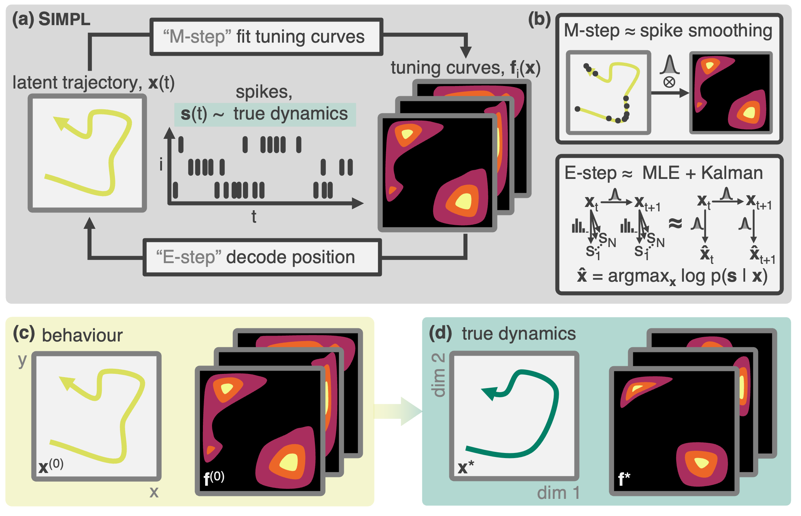

# SIMPL

This repository contains code for the paper "SIMPL: Scalable and hassle-free optimisation of neural representations from behaviour". Specifically: 

1. Source code in `simpl/` for the SIMPL algorithm.
2. A working example in `demos/simpl_demo.ipynb`.

To run the example you will need to install `simpl` by 

1. Navigating to the root of this repository.
2. (Optional) Create and activate a virtual environment (however you usually do this, for example `python -m venv venv` and `source venv/bin/activate`). 
3. Running `pip install .[demo]`. This will install the `simpl` package and its dependencies.
4. Run the demo `jupyter notebook demos/simpl_demo.ipynb` !