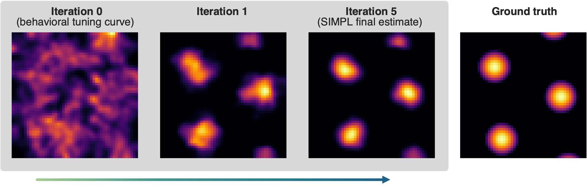
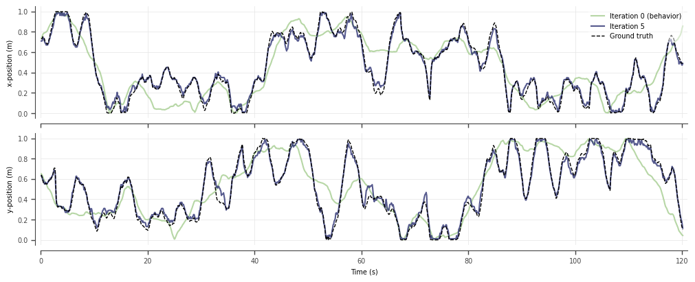
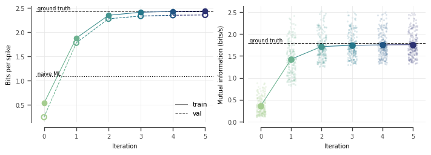

<div align="center">

<p align="center">
  
</p>

<!-- docs-badges-start -->
[](https://github.com/TomGeorge1234/SIMPL/actions/workflows/ci.yml)
[](https://colab.research.google.com/github/TomGeorge1234/SIMPL/blob/main/examples/simpl_demo.ipynb)
[](https://openreview.net/pdf?id=9kFaNwX6rv)
[](https://tomge.org/SIMPL/)
[](https://pepy.tech/projects/simpl-neuro)
<!-- docs-badges-end -->


<!-- docs-description-start -->
**SIMPL** is a JAX-python package for **optimising latent representations and neural tuning curves** from spike data. It does this by iteratively decoding the latent and fiting the tuning curves, starting from behavior or stimuli. It is lightweight, scalable, and very fast. Published at [ICLR 2025](https://openreview.net/forum?id=9kFaNwX6rv).
<!-- docs-description-end -->

[**Install**](#installation) | [**Demo**](#examples) | [**API**](#api) | [**Key Features**](#key-features) | [**Cite**](#cite)


</div> 

<!-- docs-intro-start -->
<!-- docs-features-start -->
## Key Features

- **Fast** — fits 200 neurons over 1 hour of data in under 10 seconds on CPU. GPU optional but rarely needed.
- **Scalable** - scales to state-of-the-art size neural datasets (1000s or neurons, millions of time poins, billions of spikes) on CPU.
- **Simple** — scikit-learn API. Minimal hyperparameters. Get started in <10 lines of code.
- **Flexible** — works 1D angular data (e.g. head direction), 2D spatial data (e.g. place/grid cells), and higher dimensions. Trial-structure aware. Examples and demo provided.
- **Rich outputs** — results stored as `xarray.Dataset` with per-iteration metrics, units, baselines, and diagnostics.
- **Visual** — built-in plotting for trajectories, receptive fields, spike rasters, and fitting summaries.

<p align="center">
  
  <br>
  <em> Neural data analysis in < 5 seconds </em>
</p>
<!-- docs-features-end -->

<!-- docs-install-start -->
## Installation

```bash
pip install simpl-neuro
```

To run the demo notebook locally (recommended) or [](https://colab.research.google.com/github/TomGeorge1234/simpl/blob/main/examples/simpl_demo.ipynb)
```bash
pip install "simpl-neuro[demos]"
simpl demo                # downloads demo notebook into the cwd
```
<!-- docs-install-end -->

<!-- docs-intro-end -->

<!-- docs-usage-start -->
<!-- docs-quickstart-start -->
## Quickstart

<!-- docs-quickstart-body-start -->
SIMPL follows sklearn conventions: configure hyperparameters at init, pass data to `fit()`.

```python
from simpl import SIMPL

# 1. Configure the model (no data, no computation)
model = SIMPL(
    speed_prior=0.4,        # prior on latent speed
    behavior_prior=None,    # (optional) soft tether to the initial behaviour/stimulus
    kernel_bandwidth=0.02,  # kernel bandwidth for KDE receptive field
    bin_size=0.02,          # spatial bin size for environment discretisation
)

# 2. Fit
model.fit(
    Y,                      # spike counts (T, N_neurons)
    Xb,                     # behavioural initialisation positions (T, D)
    time,                   # timestamps (T,)
    n_iterations=5,
    )

# 3. Access results
model.X_           # final decoded latent positions, shape (T, D)
model.F_           # final receptive fields, shape (N_neurons, *env_dims)
model.results_     # full xarray.Dataset with metrics, likelihoods, and baselines, across iterations.

# 4. Plot results 
model.plot_fitting_summary()  # Shows bits-per-spike metric and spike-latent mutual information. 

# (optional) Resume training if not yet converged
model.fit(Y, Xb, time, n_iterations=5, resume=True)
```

### Prediction

Decode new spikes using the fitted receptive fields (no behavioural input needed). The new data must be binned at the same `dt` as the training data.

```python
X_decoded = model.predict(Y_new)
model.prediction_results_  # xr.Dataset with rich results (mu_s, sigma_s, log-likelihoods, etc.)
```
<!-- docs-quickstart-body-end -->
<!-- docs-quickstart-end -->

<!-- docs-model-start -->
### Model (_in brief_) 

<!-- docs-model-body-start -->
<!-- docs-model-notation-start -->
#### Notation

SIMPL uses:

- **Latent trajectory:** $X$ in maths, `X` / `model.X_` in code. $X_t$ is the inferred latent at time bin $t$.
- **Latent-space coordinate:** $x$ in maths, a grid point in `model.xF_` in code. This is a possible position/location, not a whole trajectory.
- **Behavioral initialisation:** $X_{\mathrm{beh}}$ or $X_b$ in maths, `Xb` in code. This starts the fit and can optionally tether the latent through `behavior_prior`.
- **Simulation ground truth:** $X_{\mathrm{true}}$ in maths, `Xt` in code. This is only used when known, for evaluation metrics.
- **Spike counts:** $Y$ in maths/code for the full `(time, neuron)` matrix. $y_t$ is one time-bin vector, and $y_{t,n}$ is one neuron's count.
- **Receptive fields:** $F$ in maths, `F` / `model.F_` in code. $F_n(x)$ is neuron $n$'s expected spike count at latent-space point $x$.

Thus $F_n(X_t)$ is neuron $n$'s expected spike count at the decoded latent position and is the Poisson rate parameter.
<!-- docs-model-notation-end -->

<!-- docs-model-objective-start -->
#### Full objective

_This is only a summary, see [ICLR paper](https://openreview.net/forum?id=9kFaNwX6rv) for full details._ SIMPL optimises a latent trajectory $X_{1:T}$ and receptive fields $F(x)$ under:

$$
p(X_{1:T}, Y \mid F)
\;\propto\;
\prod_t
\underbrace{{\color{A92E5E}p(y_t \mid X_t, F)}}_{{\color{A92E5E}\mathrm{observation\ model}}}\,
\underbrace{{\color{1D5C84}p(X_t \mid X_{t-\Delta t})}}_{{\color{1D5C84}\mathrm{dynamics\ model}}}
$$
<!-- docs-model-objective-end -->

<!-- docs-model-dynamics-start -->
#### Dynamics model

The temporal prior is a Gaussian random-walk model controlled by $\sigma_v$ (`speed_prior`):

$$
{\color{1D5C84}p(X_t \mid X_{t-\Delta t})}
\approx
{\color{1D5C84}\mathcal{N}\!\left(X_t; X_{t-\Delta t}, (\sigma_v\,\Delta t)^2 I\right)}
$$

**Optional (`behavior_prior`)**  
SIMPL can also include a soft Gaussian tether to whatever the latent was initialised to (typically behavior), controlled by $\sigma_b$ (`behavior_prior`):

$$
{\color{1D5C84}p(X_t \mid X_{t-\Delta t})}
\propto
\underbrace{{\color{1D5C84}\mathcal{N}\!\left(X_t; X_{t-\Delta t}, (\sigma_v\,\Delta t)^2 I\right)}}_{{\color{1D5C84}\mathrm{latent\ close\ to\ previous\ latent}}}
\,
\cdot \underbrace{{\color{A3CC90}\mathcal{N}\!\left(X_t; X_t^{(0)}, \sigma_b^2 I\right)}}_{{\color{A3CC90}\mathrm{latent\ close\ to\ initialisation}}}
$$
<!-- docs-model-dynamics-end -->

<!-- docs-model-observation-start -->
#### Observation model

The spike likelihood comes from the fitted tuning curves:

$$
{\color{A92E5E}p(y_t \mid X_t, F)}
=
{\color{A92E5E}\prod_n \mathrm{Poisson}\!\left(y_{t,n}; F_n(X_t)\right)}
$$

where, for neuron $n$, $F_n(X_t)$ is the expected spike count in that time bin, i.e. its tuning curve evaluated at the decoded latent position. The tuning curve itself is estimated by the standard KDE equation from the current latent:

$$
{\color{A92E5E}F_n(x) = \frac{\sum_t y_{t,n}\,K(x, X_t)}{\sum_t K(x, X_t)}}
$$

$K$ is a Gaussian kernel with bandwidth `kernel_bandwidth`. The denominator corrects for non-uniform occupancy. Receptive fields are evaluated on a spatial grid with bin size $\Delta x$, but decoded positions are not restricted to those grid points.
<!-- docs-model-observation-end -->


<!-- docs-model-units-start -->
#### Units and discretisation

All hyperparameters (e.g. `speed_prior`, `kernel_bandwidth`, `bin_size` etc.) are defined in _data units_ (e.g. typically [m/s], [m], [m] but these depend on your data), not arbitrary time/spatial-bin units. 
<!-- docs-model-units-end -->

<!-- docs-model-body-end -->
<!-- docs-model-end -->


<!-- docs-plotting-start -->
### Plotting and Metrics

<!-- docs-plotting-body-start -->
#### Metrics

The three headline fitting metrics are:

- **Spike log-likelihood** (`logPYXF`, `logPYXF_val`) — the mean Poisson log-likelihood of the observed spike counts under the fitted receptive fields evaluated along the decoded trajectory. It answers: how well do the fitted tuning curves predict spikes at the decoded positions?

$$
\mathcal{L}
=
\sum_t \sum_n
\log \mathrm{Poisson}\!\left(y_{t,n}; F_n(X_t)\right)
$$

- **Bits per spike** (`bits_per_spike`, `bits_per_spike_val`) — how much better the fitted tuning curves explain spikes than a mean-rate baseline, in bits per observed spike. This is useful for comparing fits across datasets with different spike counts or bin sizes:

$$
\mathrm{BPS}
= \frac{\mathcal{L}(\hat{F}) - \mathcal{L}(\bar{F})}
{N_{\mathrm{spk}} \ln 2}
$$

- **Mutual information** (`mutual_information`) — the exact finite-time-bin mutual information between spike count and latent position, per neuron, in bits/s. This asks how many bits per second the spikes from each neuron carry about $X$:

$$
I(X;Y)
= \frac{1}{\Delta t}
\sum_x \sum_k
P(X=x)\,P(k \mid X=x)
\log_2
\frac{P(k \mid X=x)}{P(k)}
$$

Other metrics available in `model.results_` include:

- `spatial_information` — Skaggs spatial information in bits/s; in the small-bin limit it approaches mutual information.
- `X_R2`, `X_err` — latent-position agreement with ground truth, when `Xt` is registered with `add_baselines`.
- `F_err` — receptive-field error against ground-truth fields, when `Ft` is registered.
- `stability` — correlation between fields estimated from odd and even minutes.
- `field_change`, `trajectory_change` — per-iteration changes in tuning curves and decoded trajectory.
- `negative_entropy`, `sparsity` — compactness/sparsity summaries of the fitted tuning curves.

#### Plotting

Built-in plotting methods provide quick diagnostics. All methods return matplotlib `Axes` for further customisation — for publication-quality figures, use `model.results_` (an `xarray.Dataset`) to access the data directly.

```python
# Log-likelihood and spatial information across iterations
model.plot_fitting_summary()

# Decoded trajectory (all iterations by default)
model.plot_latent_trajectory()
model.plot_latent_trajectory(time_range=(0, 60))  # zoom in, specific iterations

# Receptive fields (iteration 0 + last by default)
model.plot_receptive_fields(neurons=[0, 5, 10])

# Spike raster heatmap (time × neurons)
model.plot_spikes()
model.plot_spikes(time_range=(0, 60))

# Auto-discover and plot all per-iteration metrics
model.plot_all_metrics(show_neurons=False)

# Prediction on held-out data
model.predict(Y_test)
model.plot_prediction(Xb=Xb_test, Xt=Xt_test)
```

<p align="center">
  
  <br>
  <em> Synthetic grid cell tuning curves optimised from a noisy behavioural initialisation </em>
</p>
<p align="center">
  
  <br>
  <em> True latent trajectory recovered by SIMPL </em>
</p>
<p align="center">
  
  <br>
  <em> Bits-per-spike and mutual-information metrics improve across epochs and exceed naive ML </em>
</p>

<!-- docs-plotting-body-end -->
<!-- docs-plotting-end -->

<!-- docs-saving-start -->
### Saving and loading

```python
model.save_results("results.nc")

# Load results as an xr.Dataset for custom analysis
from simpl import load_results
results = load_results("results.nc")

# Or rehydrate a full model for plotting, prediction, or resumed training
# (constructor arguments must exactly match the original training run)
model = SIMPL(speed_prior=0.4, kernel_bandwidth=0.025, bin_size=0.02)
model.load("results.nc")
model.fit(Y, Xb, time, n_iterations=5, resume=True)  # pick up where you left off
```
<!-- docs-saving-end -->

<!-- docs-baselines-start -->
### Ground truth baselines

If you have ground truth positions (and optionally ground truth receptive fields), register them before fitting so that baseline metrics (latent R2, field error, etc.) are computed at each iteration:

```python
model.add_baselines(Xt=Xt, Ft=Ft, Ft_coords_dict={"y": ybins, "x": xbins})
model.fit(Y, Xb, time, n_iterations=5)  # baselines computed automatically
```
<!-- docs-baselines-end -->

<!-- docs-angular-start -->
### 1D angular / circular data

SIMPL supports 1D circular latent variables (e.g. head direction) via the `is_1D_angular` flag. When enabled, the environment is fixed to [-π, π), angular KDE is used for receptive fields, and the Kalman filter wraps its state to [-π, π) after every predict, update, and smooth step.

```python
model = SIMPL(
    is_1D_angular=True,
    bin_size=np.pi / 32,
    env_pad=0.0,
    speed_prior=0.1,
    kernel_bandwidth=0.3,
)
model.fit(Y, Xb, time, n_iterations=5)  # Xb should be in radians, [-pi, pi)
```

> **Note:** The wrapped Kalman filter assumes a tight posterior (σ ≪ 2π). If posterior uncertainty is large relative to the circular domain, decoding accuracy may degrade.
<!-- docs-angular-end -->

<!-- docs-trials-start -->
### Trial boundaries

When data comes from multiple recording sessions or trials, you don't want the Kalman smoother blending across discontinuities. Pass `trial_boundaries` — an array of time-bin indices where each new trial starts — and SIMPL will run the filter/smoother independently within each segment. The initial state for each trial is estimated from the likelihood modes within that trial.

```python
# Three trials starting at time-bins 0, 5000, and 12000
model.fit(Y, Xb, time, n_iterations=5, trial_boundaries=[0, 5000, 12000])
```

If your timestamps have gaps (e.g. concatenated sessions), SIMPL will warn you and suggest using `trial_boundaries` to avoid smoothing across the jumps.
<!-- docs-trials-end -->

<!-- docs-gpu-start -->
### GPU acceleration

SIMPL auto-detects and offloads compute-heavy steps to GPU when available. Typical neural recordings (< 2 hrs) fit in under 60 s on CPU alone, so a GPU is rarely needed.


*200 neurons, dt=0.02s (50Hz), dx=2cm (2,500 bins), 5 iterations, includes JIT overheads*

```bash
pip install -U "jax[cuda12]"   # NVIDIA GPU (CUDA)
pip install ".[metal]"           # Apple Silicon GPU (experimental and not recommended, pins JAX to 0.4.35)
```

```python
model = SIMPL(use_gpu=False)   # force CPU
```
<!-- docs-gpu-end -->


<!-- docs-preprocessing-start -->
### Data preprocessing utilities

```python
from simpl import accumulate_spikes, coarsen_dt

# Roll up spikes into wider time bins (e.g. sum every 2 bins)
Y_coarse, Xb_coarse, time_coarse = coarsen_dt(Y, Xb, time, dt_multiplier=2)

# Accumulate spikes with a causal sliding window
Y_accum = accumulate_spikes(Y, window=3)
```
<!-- docs-preprocessing-end -->

<!-- docs-usage-end -->

<!-- docs-examples-start -->
## Examples/Demos

<!-- docs-examples-body-start -->
The [`examples/simpl_demo.ipynb`](https://github.com/TomGeorge1234/SIMPL/blob/main/examples/simpl_demo.ipynb) notebook walks through the full SIMPL workflow across four datasets:

1. **Synthetic grid cells** — fits SIMPL on artificial grid cell data with known ground truth, demonstrating decoded trajectories, receptive field recovery, log-likelihood improvements, and prediction on held-out data.
2. **Real place cells** — fits SIMPL on real hippocampal place cell recordings from [Tanni et al. (2022)](https://pubmed.ncbi.nlm.nih.gov/35835121/), where no ground truth is available.
3. **Real head direction cells** — fits SIMPL in 1D angular mode on head direction cell recordings from [Vollan et al. (2025)](https://www.nature.com/articles/s41586-024-08527-1), demonstrating circular latent variable decoding and polar receptive field plots.
4. **Motor cortex hand reaching** — fits SIMPL on somatosensory cortex recordings from [Chowdhury et al. (2020)](https://pubmed.ncbi.nlm.nih.gov/31971510/), demonstrating higher-dimensional latent variables (2D and 4D) and model comparison across different behavioural initialisations (position vs velocity vs combined).

[](https://colab.research.google.com/github/TomGeorge1234/SIMPL/blob/main/examples/simpl_demo.ipynb)
<!-- docs-examples-body-end -->
<!-- docs-examples-end -->

<!-- docs-package-start -->
## Package Structure

```
src/simpl/
├── __init__.py        # Top-level exports: SIMPL, load_datafile, ...
├── simpl.py           # Core SIMPL class (EM algorithm, fit/predict)
├── kde.py             # KDE, Poisson log-likelihood, gaussian_kernel
├── kalman.py          # KalmanFilter class + Kalman functions
├── environment.py     # Environment class (spatial discretisation)
├── plotting.py        # Built-in diagnostic plots (trajectory, fields, metrics)
└── utils.py           # Gaussian helpers, CCA, data prep, I/O
```
<!-- docs-package-end -->

<!-- docs-development-start -->
## Development

```bash
# Install for development
pip install -e ".[dev]"

# Lint
ruff check src/
ruff format --check src/

# Run tests
pytest
```
<!-- docs-development-end -->

<!-- docs-cite-start -->
## Cite
If you use SIMPL in your work, please cite it as:

> Tom George, Pierre Glaser, Kim Stachenfeld, Caswell Barry, & Claudia Clopath (2025). SIMPL: Scalable and hassle-free optimisation of neural representations from behaviour. In The Thirteenth International Conference on Learning Representations.

```
@inproceedings{
    george2025simpl,
    title={{SIMPL}: Scalable and hassle-free optimisation of neural representations from behaviour},
    author={Tom George and Pierre Glaser and Kim Stachenfeld and Caswell Barry and Claudia Clopath},
    booktitle={The Thirteenth International Conference on Learning Representations},
    year={2025},
    url={https://openreview.net/forum?id=9kFaNwX6rv}
}
```
<!-- docs-cite-end -->
