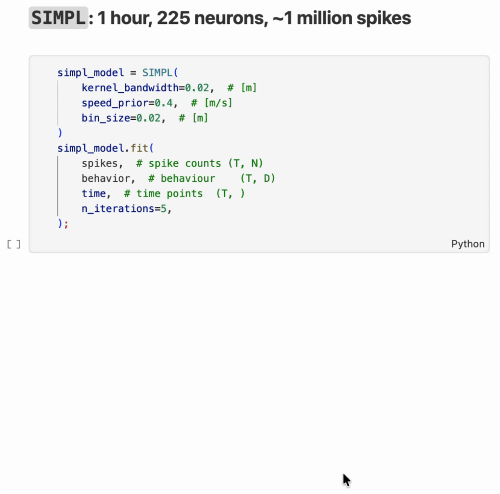
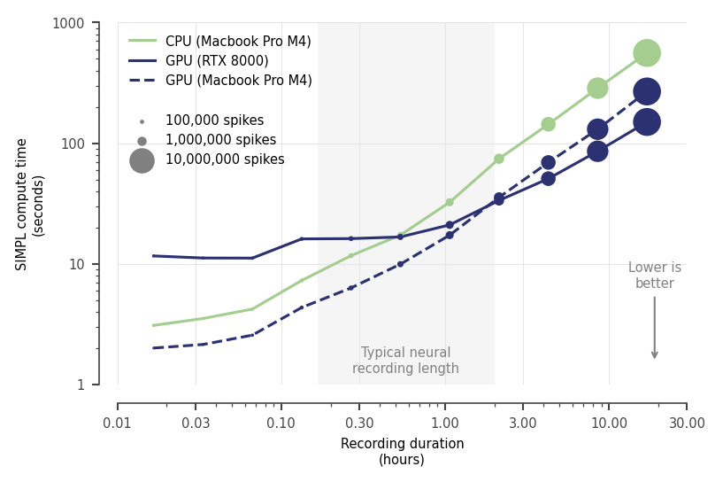

# SIMPL

[](https://github.com/TomGeorge1234/SIMPL/actions/workflows/ci.yml)
[](https://tomge.org/SIMPL/)
[](https://colab.research.google.com/github/TomGeorge1234/SIMPL/blob/main/examples/simpl_demo.ipynb)
[](https://openreview.net/pdf?id=9kFaNwX6rv)
<!-- [](https://pepy.tech/projects/simpl-neuro) -->

**SIMPL** is a Python package for decoding latent neural representations from spike data using an EM algorithm that alternates between Kalman filtering and kernel density estimation. Published at [ICLR 2025](https://openreview.net/forum?id=9kFaNwX6rv).

[**Install**](#installation) | [**Demo**](#examples) | [**API**](#api) | [**Key Features**](#key-features) | [**Cite**](#cite)


*Quick demo: the basic API and a clip of SIMPL training in real time.*

## ✨ Key Features

- ⚡ **Fast** — fits 100 neurons over 1 hour of data in under 10 seconds on CPU. GPU optional but rarely needed.
- 🎯 **Simple** — scikit-learn-style `fit()` / `predict()` API. Get started in <10 lines of code.
- 🧠 **Flexible** — works with 1D angular data (e.g. head direction), 2D spatial data (e.g. place/grid cells), and higher dimensions.
- 📊 **Rich outputs** — results stored as `xarray.Dataset` with per-iteration metrics, units, baselines, and diagnostics.
- 📈 **Visual** — built-in plotting for trajectories, receptive fields, spike rasters, and fitting summaries.

<p align="center">
  
  <br>
  <em>Neural data analysis in <5 seconds (your mileage may vary)</em>
</p>

<!-- docs-intro-start -->
## 🚀 Installation
This repository contains code for the ICLR 2025 paper "_SIMPL: Scalable and hassle-free optimisation of neural representations from behaviour_" ([ICLR](https://openreview.net/forum?id=9kFaNwX6rv)). Specifically:

* Source code in `src/simpl/` for the SIMPL algorithm.
* A working example in `examples/simpl_demo.ipynb`.

To run the example you will need to install `simpl` by

1. **Clone**: `git clone https://github.com/TomGeorge1234/SIMPL.git` and navigate to the root: `cd SIMPL`
2. _(Recommended)_ Create a virtual environment (e.g. `python -m venv simpl_env` and `source simpl_env/bin/activate`).
3. **Install**: `pip install .[demos]`. This will install the `simpl` package and its dependencies.
4. **Run the demo**: `jupyter notebook examples/simpl_demo.ipynb` !

<!-- docs-intro-end -->

<!-- docs-usage-start -->
## 🔧 API

SIMPL follows sklearn conventions: configure hyperparameters at init, pass data to `fit()`.

```python
from simpl import SIMPL

# 1. Configure the model (no data, no computation)
model = SIMPL(
    speed_prior=0.4,        # prior on agent speed (m/s) — controls Kalman smoothing
    kernel_bandwidth=0.02,  # KDE bandwidth for fitting receptive fields
    bin_size=0.02,          # spatial bin size for environment discretisation
    env_pad=0.0,            # padding around data bounds
)

# 2. Fit
model.fit(
    Y,                      # spike counts (T, N_neurons)
    Xb,                     # behavioural initialisation positions (T, D)
    time,                   # timestamps (T,)
    n_iterations=5,
    )

# 3. Access results
model.X_           # final decoded latent positions, shape (T, D)
model.F_           # final receptive fields, shape (N_neurons, *env_dims)
model.results_     # full xarray.Dataset with metrics, likelihoods, and baselines, across iterations.

# Resume training if not yet converged
model.fit(Y, Xb, time, n_iterations=5, resume=True)
```

### Prediction

Decode new spikes using the fitted receptive fields (no behavioural input needed). The new data must be binned at the same `dt` as the training data.

```python
X_decoded = model.predict(Y_new)
model.prediction_results_  # xr.Dataset with rich results (mu_s, sigma_s, log-likelihoods, etc.)
```

### Plotting

Built-in plotting methods provide quick diagnostics. All methods return matplotlib `Axes` for further customisation — for publication-quality figures, use `model.results_` (an `xarray.Dataset`) to access the data directly.

```python
# Log-likelihood and spatial information across iterations
model.plot_fitting_summary()

# Decoded trajectory (all iterations by default)
model.plot_latent_trajectory()
model.plot_latent_trajectory(time_range=(0, 60))  # zoom in, specific iterations

# Receptive fields (iteration 0 + last by default)
model.plot_receptive_fields(neurons=[0, 5, 10])

# Spike raster heatmap (time × neurons)
model.plot_spikes()
model.plot_spikes(time_range=(0, 60))

# Auto-discover and plot all per-iteration metrics
model.plot_all_metrics(show_neurons=False)

# Prediction on held-out data
model.predict(Y_test)
model.plot_prediction(Xb=Xb_test, Xt=Xt_test)
```

### Saving and loading

```python
model.save_results("results.nc")

# Load results as an xr.Dataset for custom analysis
from simpl import load_results
results = load_results("results.nc")

# Or rehydrate a full model for plotting, prediction, or resumed training
# (constructor arguments must exactly match the original training run)
model = SIMPL(speed_prior=0.4, kernel_bandwidth=0.025, bin_size=0.02)
model.load("results.nc")
model.fit(Y, Xb, time, n_iterations=5, resume=True)  # pick up where you left off
```

### Ground truth baselines

If you have ground truth positions (and optionally ground truth receptive fields), register them before fitting so that baseline metrics (latent R2, field error, etc.) are computed at each iteration:

```python
model.add_baselines(Xt=Xt, Ft=Ft, Ft_coords_dict={"y": ybins, "x": xbins})
model.fit(Y, Xb, time, n_iterations=5)  # baselines computed automatically
```

### 1D angular / circular data

SIMPL supports 1D circular latent variables (e.g. head direction) via the `is_1D_angular` flag. When enabled, the environment is fixed to [-π, π), angular KDE is used for receptive fields, and the Kalman filter wraps its state to [-π, π) after every predict, update, and smooth step.

```python
model = SIMPL(
    is_1D_angular=True,
    bin_size=np.pi / 32,
    env_pad=0.0,
    speed_prior=0.1,
    kernel_bandwidth=0.3,
)
model.fit(Y, Xb, time, n_iterations=5)  # Xb should be in radians, [-pi, pi)
```

> **Note:** The wrapped Kalman filter assumes a tight posterior (σ ≪ 2π). If posterior uncertainty is large relative to the circular domain, decoding accuracy may degrade.

### Trial boundaries

When data comes from multiple recording sessions or trials, you don't want the Kalman smoother blending across discontinuities. Pass `trial_boundaries` — an array of time-bin indices where each new trial starts — and SIMPL will run the filter/smoother independently within each segment. The initial state for each trial is estimated from the likelihood modes within that trial.

```python
# Three trials starting at time-bins 0, 5000, and 12000
model.fit(Y, Xb, time, n_iterations=5, trial_boundaries=[0, 5000, 12000])
```

If your timestamps have gaps (e.g. concatenated sessions), SIMPL will warn you and suggest using `trial_boundaries` to avoid smoothing across the jumps.

### GPU acceleration

SIMPL auto-detects and offloads compute-heavy steps to GPU when available. Typical neural recordings (< 2 hrs) fit in under 60 s on CPU alone, so a GPU is rarely needed.



*200 neurons, dt=0.02s (50Hz), dx=2cm (2,500 bins), 5 iterations, includes JIT overheads*

```bash
pip install -U "jax[cuda12]"   # NVIDIA GPU (CUDA)
pip install .[metal]           # Apple Silicon GPU (experimental and not recommended, pins JAX to 0.4.35)
```

```python
model = SIMPL(use_gpu=False)   # force CPU
```


### Data preprocessing utilities

```python
from simpl import accumulate_spikes, coarsen_dt

# Roll up spikes into wider time bins (e.g. sum every 2 bins)
Y_coarse, Xb_coarse, time_coarse = coarsen_dt(Y, Xb, time, dt_multiplier=2)

# Accumulate spikes with a causal sliding window
Y_accum = accumulate_spikes(Y, window=3)
```

<!-- docs-usage-end -->

## 📓 Examples

The [`examples/simpl_demo.ipynb`](examples/simpl_demo.ipynb) notebook walks through the full SIMPL workflow across four datasets:

1. **Synthetic grid cells** — fits SIMPL on artificial grid cell data with known ground truth, demonstrating decoded trajectories, receptive field recovery, log-likelihood improvements, and prediction on held-out data.
2. **Real place cells** — fits SIMPL on real hippocampal place cell recordings from [Tanni et al. (2022)](https://pubmed.ncbi.nlm.nih.gov/35835121/), where no ground truth is available.
3. **Real head direction cells** — fits SIMPL in 1D angular mode on head direction cell recordings from [Vollan et al. (2025)](https://www.nature.com/articles/s41586-024-08527-1), demonstrating circular latent variable decoding and polar receptive field plots.
4. **Motor cortex hand reaching** — fits SIMPL on somatosensory cortex recordings from [Chowdhury et al. (2020)](https://pubmed.ncbi.nlm.nih.gov/31971510/), demonstrating higher-dimensional latent variables (2D and 4D) and model comparison across different behavioural initialisations (position vs velocity vs combined).

[](https://colab.research.google.com/github/TomGeorge1234/SIMPL/blob/main/examples/simpl_demo.ipynb)

## 📦 Package Structure

```
src/simpl/
├── __init__.py        # Top-level exports: SIMPL, load_datafile, ...
├── simpl.py           # Core SIMPL class (EM algorithm, fit/predict)
├── plotting.py        # Built-in diagnostic plots (trajectory, fields, metrics)
├── environment.py     # Environment class (spatial discretisation)
├── utils.py           # Gaussian helpers, CCA, data prep, I/O
├── kalman.py          # KalmanFilter class + Kalman functions
├── kde.py             # KDE, Poisson log-likelihood, gaussian_kernel
└── data/              # Bundled demo data
```

## 🧪 Development

```bash
# Install for development
pip install -e ".[dev]"

# Lint
ruff check src/
ruff format --check src/

# Run tests
pytest
```

## 📝 Cite
If you use SIMPL in your work, please cite it as:

> Tom George, Pierre Glaser, Kim Stachenfeld, Caswell Barry, & Claudia Clopath (2025). SIMPL: Scalable and hassle-free optimisation of neural representations from behaviour. In The Thirteenth International Conference on Learning Representations.

```
@inproceedings{
    george2025simpl,
    title={{SIMPL}: Scalable and hassle-free optimisation of neural representations from behaviour},
    author={Tom George and Pierre Glaser and Kim Stachenfeld and Caswell Barry and Claudia Clopath},
    booktitle={The Thirteenth International Conference on Learning Representations},
    year={2025},
    url={https://openreview.net/forum?id=9kFaNwX6rv}
}
```
